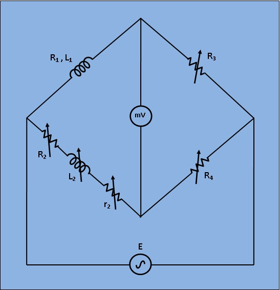

# Introduction

To determine the self-inductance of an unknown coil. 

## Theory

  This bridge circuit measures an inductance by comparison with variable standard self inductance. The connections for balance condition is shown in Fig. 1.

***Fig 1: Circuit Diagram for Measurement of Self Inductance by Maxwell Bridge***

Let,
`L_1`= Unknown self Inductance of resistance `R_1`,

`L_2`= variable inductance of fixed resistance `r_2`,

`R_2`= variable resistance connected in series with inductor `L_2`,

`R_3`,`R_4`= known non inductive resistances,

At balance condition, 

`(R_1 +jomegaL_1)*R_4 = (R_2 + r_2 + jomegaL_2)*R_3` ...(1)

Equating both the real and imaginary parts in eq.`(1)` and seperating them,

`L_1 =(R_3/R_4)L_2` ...(2)
 

`R_1 = (R_3/R_4)*(R_2+r_2)` ...(3)
 

Resistors `R_3` and `R_4` are normally a selection of values from 10, 100, 1000 and 10,000 `Ω`. `r_2` is a decade resistance box.
